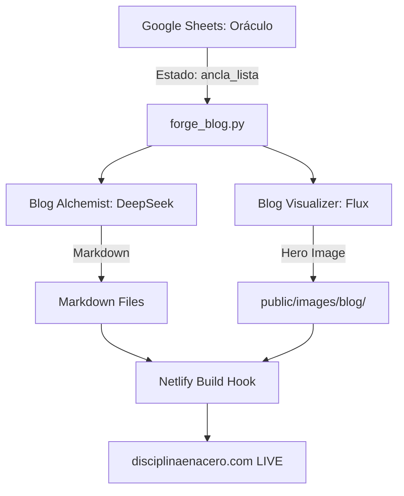

# ⚔️ MIURA FORGE ARCHITECTURE — The Soul of the Machine ⚔️

**Versión:** 2026.3.28 (Post-Veredicto Global)
**Filosofía:** Clean Architecture + Resiliencia Industrial

---

## 1. Capas del Sistema (High-Level)

El Miura Forge Engine está estructurado en capas para separar la lógica de negocio (Doctrina) de los proveedores externos (NVIDIA, Google, Netlify).

### 🟦 1.1 Core (El Motor)
Contiene la lógica fundamental de procesamiento.
- **`database.py`:** El "Escudo de Estructura". Gestiona Google Sheets de forma resiliente, autocompletando columnas faltantes y asegurando la integridad de los datos.
- **`forge_blog.py`:** Orquestador del pipeline del blog. Filtra, genera y dispara el despliegue.
- **`blog_alchemist.py`:** Inteligencia Textual. Genera reseñas inyectando la "Voz del Soberano" (DeepSeek V3.2).
- **`blog_visualizer.py`:** Inteligencia Visual. Diseña prompts (Gemma 3) y forja imágenes cinematográficas (Flux Schnell).

### 🟨 1.2 LLM Layer (El Cerebro)
Abstracción total sobre los modelos de IA.
- **`factory.py`:** Asignación dinámica de modelos por tarea (merch, research, visual, etc.).
- **`providers.py`:** Implementación de la **Directiva de Resiliencia**. Si falla un Tier (ej: NVIDIA), el sistema conmuta automáticamente al siguiente (ej: Gemini).

### 🟥 1.3 Tools & Outreach (Las Herramientas)
- **`marketing/`:** Módulo de OSINT y Email Marketing.
- **`motion_forge/`:** Generación de video con Meta AI y Replicate.
- **`youtube_publisher/`:** Automatización de subidas a YouTube Studio.

---

## 2. Flujo de Datos (Data Pipeline)

---

## 3. Directivas de Seguridad y Calidad

### 🛡️ 3.1 Escudo de Estructura
Cualquier cambio en los requerimientos de datos (ej: nueva columna en Sheets) se propaga automáticamente desde el código a la nube sin intervención manual ni pérdida de registros.

### 🧪 3.2 Calidad Industrial (Tests)
Ubicados en `/tests`, aseguran que:
- Los prompts siempre incluyan el "Ancla de Verdad".
- El Visualizer guarde los archivos en la ruta correcta de Astro.
- La rotación de API Keys en NVIDIA y Gemini sea invisible para el usuario.

### 🤖 3.3 El Guardián (GitHub Actions)
Toda modificación en el Core requiere que el 100% de los tests sean verdes (`pytest`) antes de considerarse una versión estable de la Forja.

---

## 4. Stack Tecnológico 2026

- **Backend:** Python 3.10+
- **Frontend:** Astro 5 (disciplinaenacero)
- **Modelos:** DeepSeek-V3.2, Gemma 3, Mistral Large 3, Flux 1 Schnell
- **Infraestructura:** Google Sheets API, Netlify, GitHub Actions
